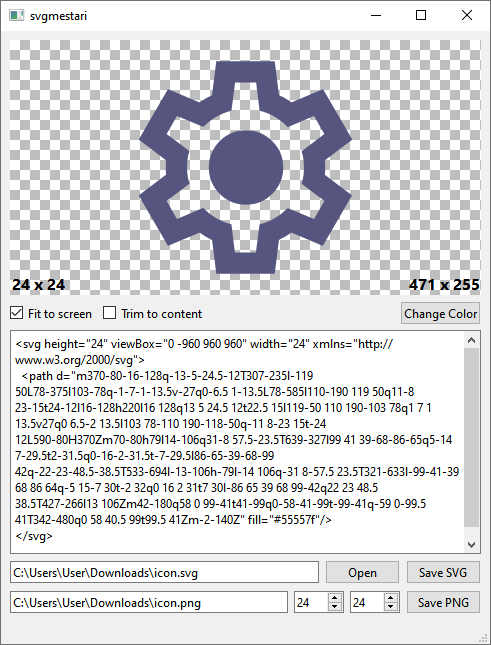

# svgmestari

## Features

- Edit SVG code with live rendering.
- Change fill color of path elements (useful for icons).
- Trim to content feature removes transparent areas at the edges of an image.
- Export to PNG.

## License

[GPL-3.0](LICENSE)
